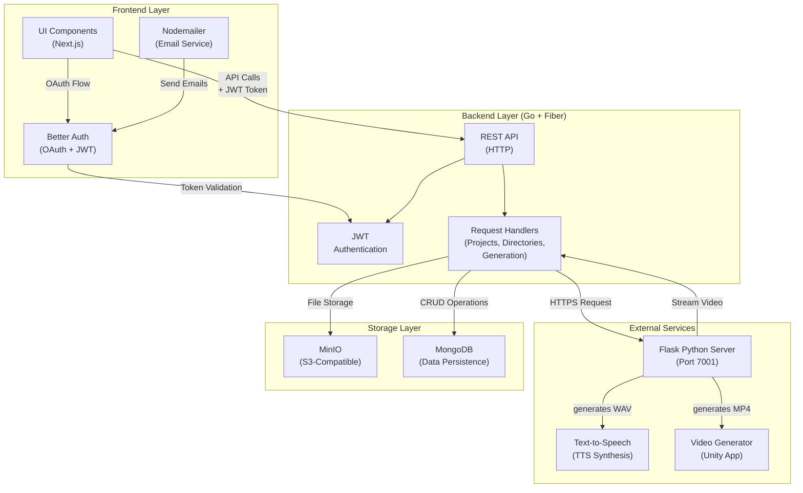

# DUBME System Architecture

## Overview

DUBME adopts a **cloud-native, containerized architecture** that separates the system into three independent layers:

- **Presentation Layer** (Frontend UI)
- **Logic & API Layer** (Backend Services)
- **Persistence & External Services Layer** (Storage, Databases, TTS/Video Generation)

This architecture ensures **horizontal scalability**, **maintainability**, and **guest isolation**.



## Layer Descriptions

### 1. Frontend Layer (Next.js + TypeScript)

**Location:** `/frontend`

- React components with **shadcn/ui** and **Aceternity UI**
- **Better Auth** integration for authentication (email, Google, GitHub OAuth)
- **Nodemailer** for sending verification emails and password reset emails
- Internationalization with `next-intl` (EN, ES, FR, IT)
- Client-side form validation and state management
- Communicates with backend via REST API using JWT tokens

### 2. Backend Layer (Go + Fiber Framework)

**Location:** `/backend`

- **REST API** built with GoFiber framework
- **JWT Authentication** middleware for secure token validation
- **Request Handlers:**
  - `projects.go`: Project CRUD operations
  - `directories.go`: Directory management
  - `generator.go`: Proxies requests to Flask server and handles video streaming
- **CORS configuration** for frontend communication

### 3. External Services Layer

#### Flask Python Server (Port 7001)

**Location:** `/generator/server.py`

- **TTS Processing:** Receives text, generates speech using TTS engine
- **Video Generation:** Applies TTS output to 3D avatar model
- **Supported Platforms:**
  - **macOS:** Uses TestMac.app (Unity-compiled binary)
  - **Windows:** Uses stv-win/VideoGenerator.exe
- **Not supported:** Linux (can be added if needed)
- **Output:** Returns MP4 video stream with custom filename

#### Storage Services

- **MinIO:** S3-compatible object storage for video files
- **MongoDB:** NoSQL database for projects, directories, user profiles, and metadata

## Request Flow: Video Generation

```
1. User submits text + avatar preferences (UI)
   ↓
2. Frontend sends POST /api/generate to Backend (with JWT token)
   ↓
3. Backend validates JWT token
   ↓
4. Backend forwards request to Flask server (http://generator:7001)
   ↓
5. Flask executes TTS engine (text → WAV)
   ↓
6. Flask calls Unity VideoGenerator binary (WAV → MP4)
   ↓
7. Flask returns MP4 stream + metadata header
   ↓
8. Backend streams video to Frontend
   ↓
9. Frontend downloads/previews video
   ↓
10. (Optional) Backend saves video to MinIO + metadata to MongoDB
```

## Environment Separation

### Development Mode (DEV_MODE=true)

- Bypasses authentication checks
- Uses development credentials
- Flask server runs on local machine
- MongoDB and MinIO run in Docker containers

### Production Mode (DEV_MODE=false)

- Full authentication and authorization
- Production credentials in environment variables
- All services (without including Flask) containerized or deployed
- Secure CORS configuration

## Deployment Architecture

### Docker Compose Stack

All services except Flask are containerized:

1. **MongoDB** - Data persistence
2. **MinIO** - File storage
3. **Backend (Go)** - API server
4. **Frontend (Next.js)** - Web UI

### Flask Server

Runs **locally on developer machine** or on a **separate server**:

- Managed separately from Docker stack
- Communicates with backend via HTTP
- Requires Python 3.11+ and Unity-compiled binaries

## Security Considerations

1. **JWT Token Validation:** Every API request must include a valid JWT token
2. **CORS Policy:** Only frontend origin allowed
3. **MinIO Access:** Credentials stored in environment variables
4. **MongoDB Auth:** URI includes credentials
5. **Email Service:** Gmail app-specific password (not plain password)
6. **OAuth Secrets:** Google and GitHub credentials kept in .env

## Scalability Points

- **Horizontal Frontend Scaling:** Multiple Next.js replicas behind load balancer
- **Horizontal Backend Scaling:** Multiple GoFiber instances behind load balancer
- **Database Scaling:** MongoDB replica set for redundancy
- **Storage Scaling:** MinIO distributed mode for multiple nodes
- **Video Generation:** Flask can run on dedicated server or cluster of workers

---

**Note:** This architecture is designed to be cloud-agnostic and can be deployed on:

- Local development environment (Docker Compose)
- Kubernetes cluster (with Helm charts)
- Cloud providers (AWS, GCP, Azure)
- VPS or dedicated servers
